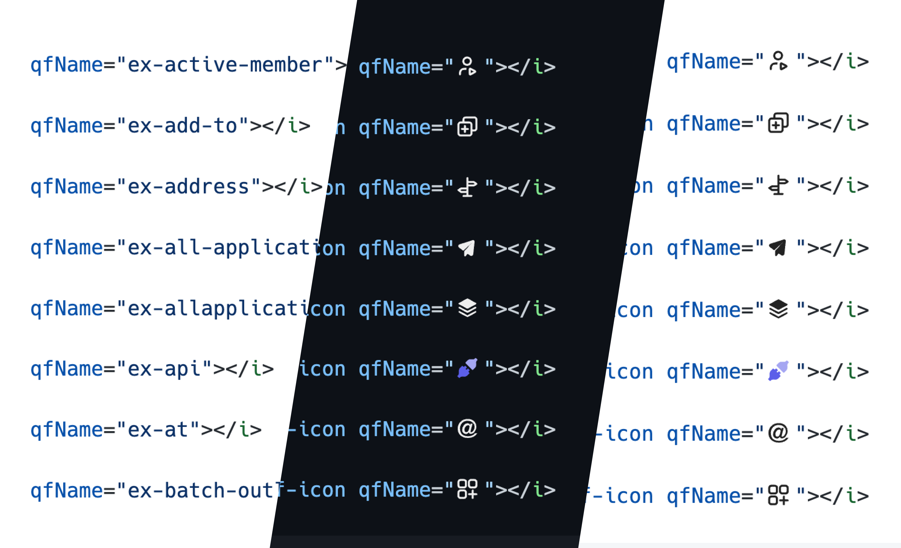

  

<h1 align="center">iconize</h1>

 

Customizable inline icon 💗 preview for VS Code

 

  

### ✨ Features

- Inline display corresponding icons
- Snippets
- Change Icon color for Dark/Light theme

### ⌛ TODO

- ✅ Auto completions for iconsets
- ✅ Hover message
- [customize docs](./docs.md)

### ❤️ THX

- [antfu](https://antfu.me/)

- [Xander](mailto:liuyiyang@exiao.tech) PROMOTIONAL IMAGE

## License

[MIT](./LICENSE) License © 2022 [Yurica](https://github.com/yurica7)

  

